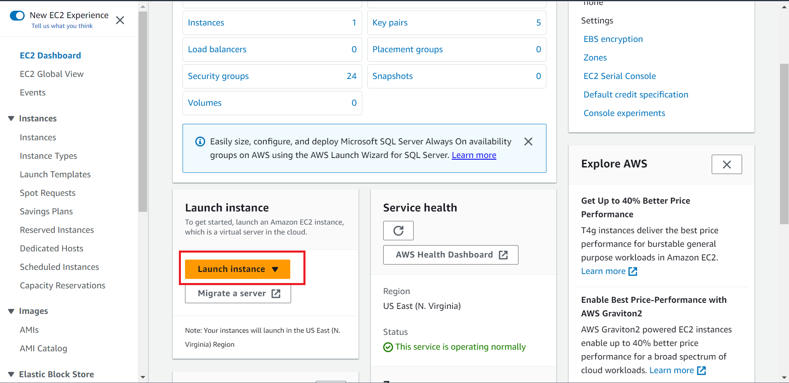
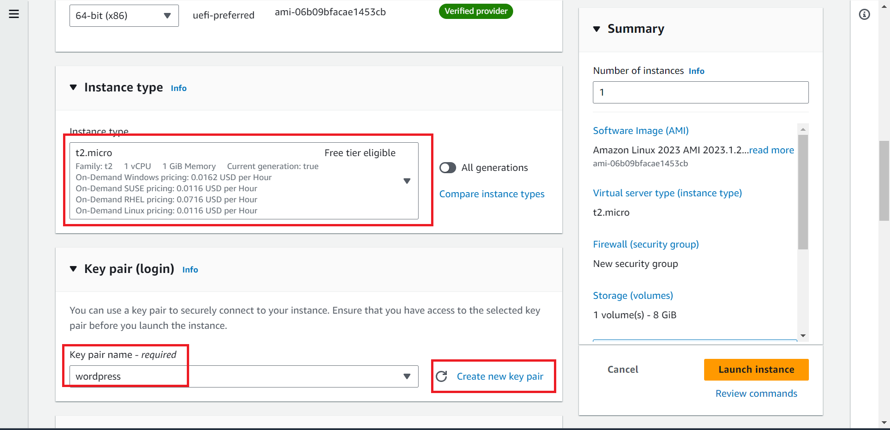
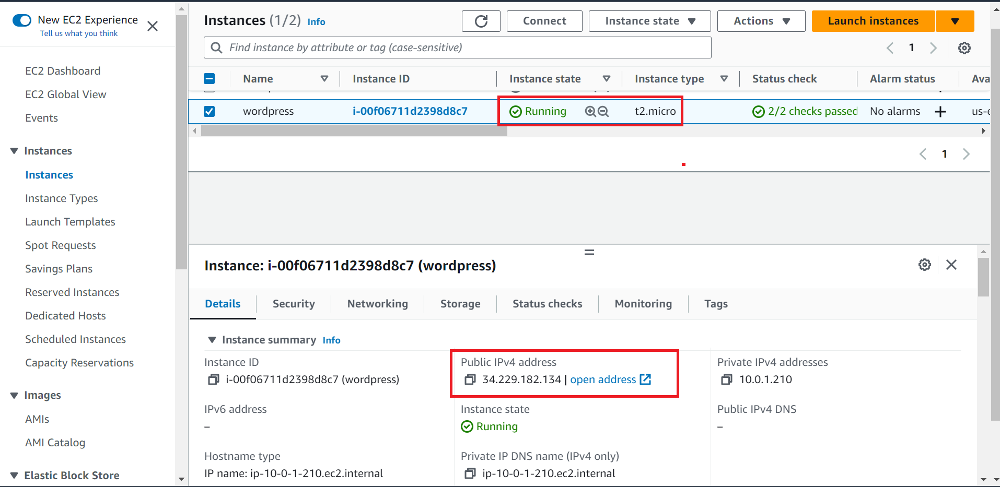

# How to install wordpress on AWS ec2 instance using script
1. Login your aws console and follow the steps
        
        
        
        
        
        
        
        
        
        
        
        
  2. Open Mobaxtreme or any othe tools and connect to the server   
        
        

 3. Create file wordpress-install.sh   
        
 4. Copy this code on this file and run this script    
    <a href="scripts/wordpress-install.sh"> wordpress-install </a>    
         
         
  5. After successfull install    
           
         
